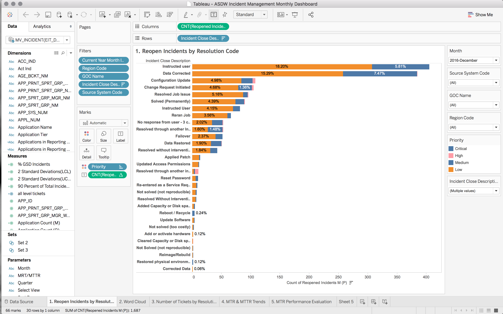
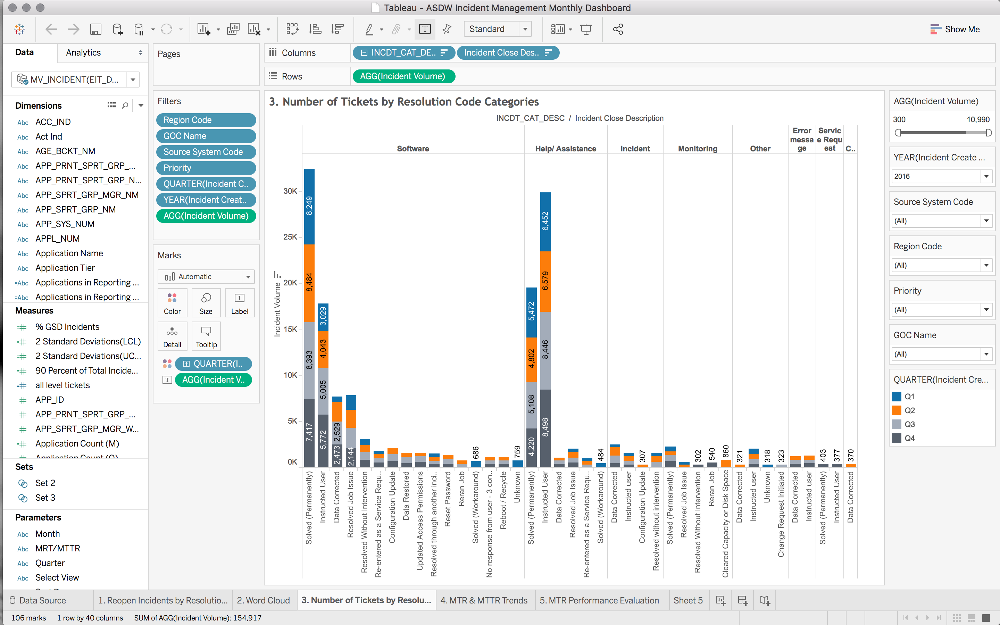
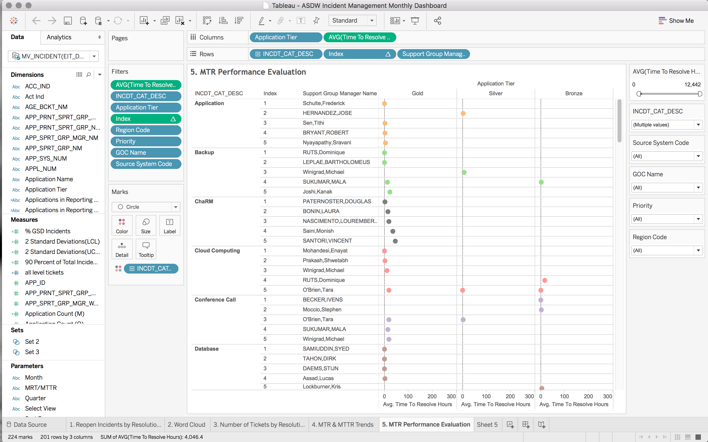
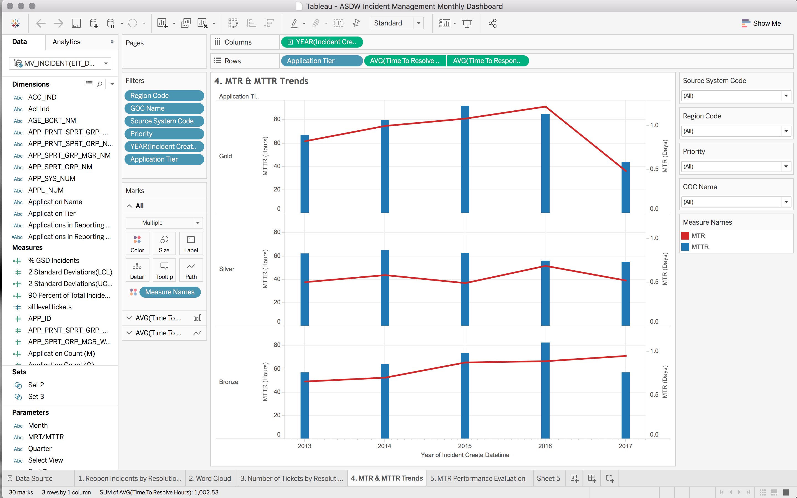
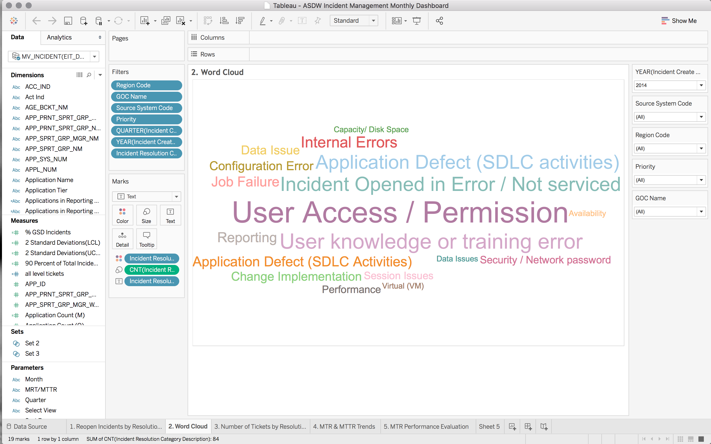
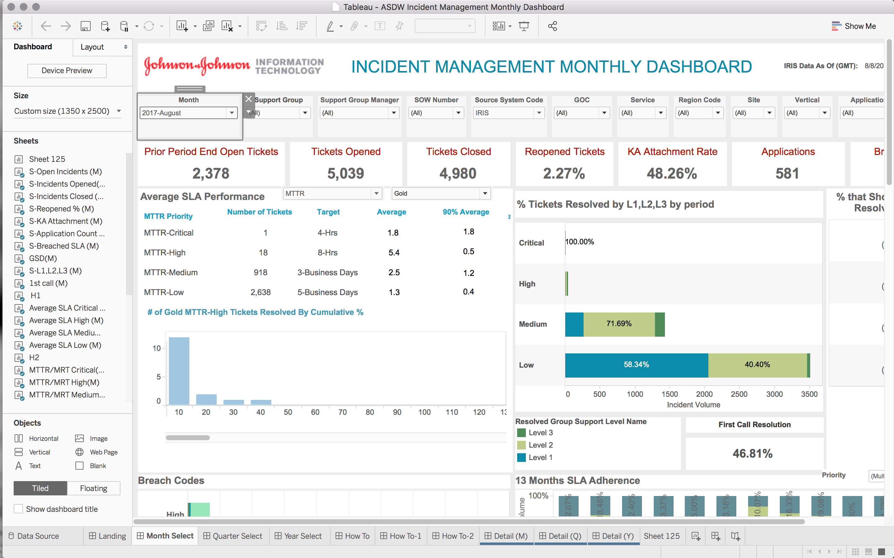
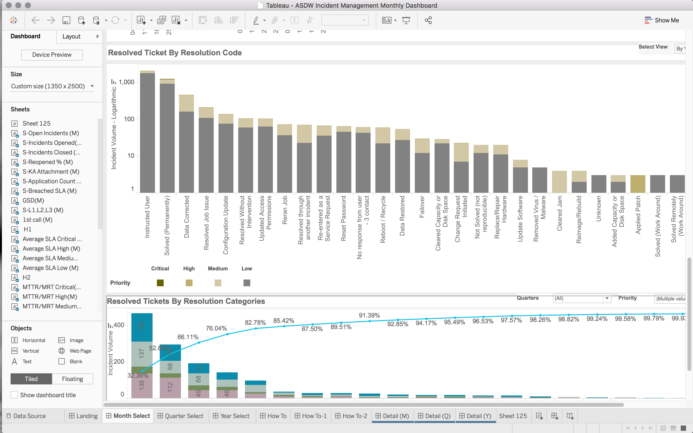

# Incident-management

This is the project for Johnson & Johnson. We actually help them to find some insights from current incident management process.

The data source belongs to Johnson & Johnson. I can't share here. I can only share the tableau outputs.

### Output

##### Reopen Incidents by Resolutoin Code

Separating by resolution code, Insights about current categories and SLA are generated.

##### Number of Tickets  by Resolution Code

From this graph, we want to monitor quarterly tickets changing.

##### Mean Time Resolution Evaluation

Different team's performance is monitored by this visual.

##### Mean Time Resolution

This is also related to SLA analysis. It monitors current SLA performance.

##### Product Word Clound

Find the most frequent reasons for incidents.

### Dashboard

Final Dashboard

Find the most frequent reasons for incidents.

